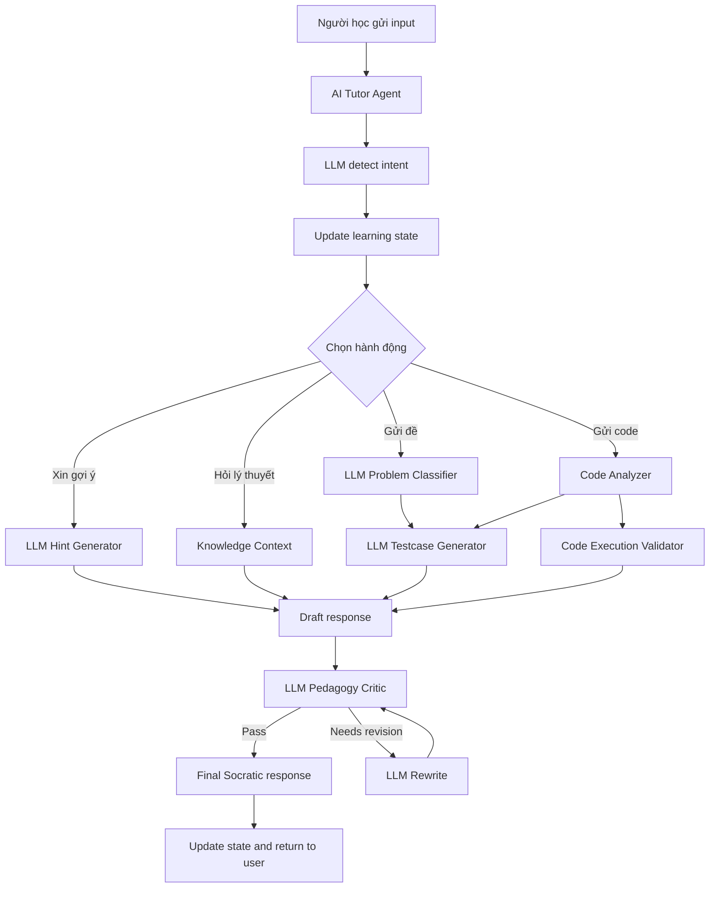

# Kiến trúc hệ thống Multi-Agent

## Tổng quan

Hệ thống được thiết kế thành **LLM-powered multi-agent tutoring system** cho môn Cấu trúc dữ liệu và Giải thuật. `AI Tutor Agent` là trung tâm điều phối, còn các module và quality agents đóng vai trò công cụ chuyên biệt.

Mục tiêu chính không phải sinh lời giải nhanh, mà là dẫn dắt người học suy nghĩ, tự kiểm chứng và cải thiện lời giải theo từng bước.

## 5 lớp kiến trúc

1. **User Interface**
   - Streamlit chat UI cho sinh viên gửi đề bài, câu hỏi, ý tưởng, code hoặc yêu cầu gợi ý.
   - Hỗ trợ nhiều phiên chat ở cột bên trái.
   - Hiển thị phản hồi Socratic, testcase gợi ý và tóm tắt trạng thái học tập.

2. **Tutor Orchestration Layer**
   - `AI Tutor Agent` nhận input, dùng LLM nhận diện intent, cập nhật trạng thái và chọn tool/agent phù hợp.
   - `LangGraph` biểu diễn workflow theo trạng thái để dễ mở rộng và trình bày trong đồ án. Workflow hiện đã tách node theo intent, không còn gom toàn bộ xử lý vào một node duy nhất.
   - Agent không trả lời trực tiếp từ LLM thô; mọi phản hồi cần đi qua policy và quality review.

3. **Learning Modules**
   - `LLM Problem Classifier`: phân loại chủ đề và pattern DSA.
   - `Hint Generator`: sinh gợi ý nhiều cấp theo trạng thái học.
   - `Code Analyzer`: phân tích ý tưởng, độ phức tạp, edge cases và điểm cần kiểm tra.
   - `Knowledge Context`: taxonomy, rubric và guideline nội bộ dùng để đưa thêm ngữ cảnh cho prompt.

4. **Quality Layer**
   - `Testcase Generator Agent`: dùng LLM sinh testcase cơ bản, edge, adversarial hoặc stress.
   - `Code Execution Validator Agent`: chạy code Python trong sandbox khi testcase có expected output.
   - `Pedagogy Critic Agent`: dùng LLM kiểm phản hồi có đúng tinh thần Socratic và không lộ lời giải quá sớm.

5. **State and Memory Layer**
   - Lưu session, bài toán hiện tại, hint level, attempts, misconceptions, testcase history, validation result và pedagogy flags.

## Luồng xử lý chính

## Chính sách phản hồi

- Không đưa full code hoặc lời giải hoàn chỉnh trong chế độ Socratic mặc định.
- Mỗi lượt chỉ tập trung 1-2 câu hỏi hoặc gợi ý chính.
- Nếu sinh viên mới gửi đề bài, agent hỏi lại input/output/ràng buộc trước.
- Nếu sinh viên bị tắc, agent tăng hint level từng bước.
- Nếu sinh viên gửi code, agent ưu tiên trace, edge case và độ phức tạp thay vì sửa hộ.
- Testcase có thể hiển thị như case tự kiểm; lời giải tham chiếu nếu có chỉ dùng nội bộ.

## Công nghệ triển khai hiện tại

- `Streamlit`: giao diện demo, không cần backend riêng.
- `LangGraph`: workflow orchestration.
- `Gemini API`: LLM generation thông qua `GEMINI_API_KEY`.
- `python-dotenv`: đọc cấu hình từ `.env`.
- Python modules nội bộ: code analysis, quality schemas, sandbox validator và guideline/reference modules.

## Trạng thái hội thoại

Mỗi session lưu tối thiểu:

- `session_id`
- `current_problem`
- `problem_type`
- `concepts`
- `hint_level`
- `student_attempts`
- `misconceptions`
- `generated_tests`
- `latest_validation`
- `pedagogy_flags`
- `next_action`
