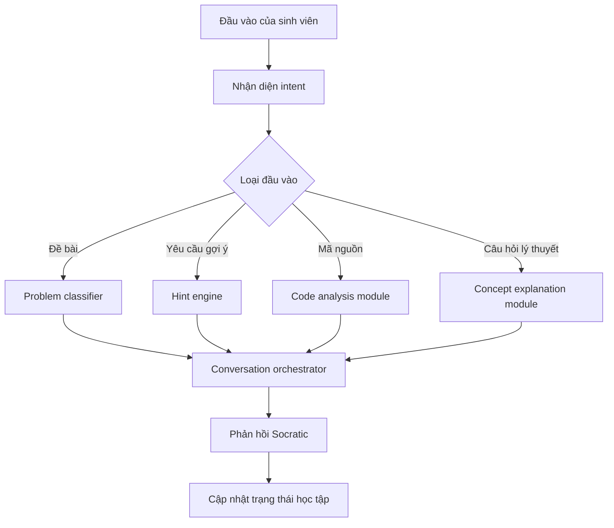

# Kiến trúc hệ thống

## Tổng quan

Hệ thống gồm 4 lớp chính:

1. **User Interface**
   - Giao diện chat cho sinh viên nhập câu hỏi, đề bài hoặc code.
   - Hiển thị gợi ý theo từng mức.
   - Cho phép sinh viên yêu cầu thêm gợi ý hoặc gửi ý tưởng/code mới.

2. **Agent Orchestration Layer**
   - Phân tích intent đầu vào.
   - Điều phối các module chuyên biệt.
   - Quản lý trạng thái hội thoại.
   - Áp dụng chính sách không đưa lời giải trực tiếp.

3. **Learning Intelligence Modules**
   - Problem Classifier.
   - Socratic Hint Engine.
   - Code Analysis Module.
   - Concept Explanation Module.

4. **Data and Memory Layer**
   - Session memory: nội dung hội thoại hiện tại.
   - Learning state: dạng bài, mức gợi ý hiện tại, mức độ hiểu của sinh viên.
   - Knowledge base: khái niệm DSA, taxonomy bài tập, rubric đánh giá code.

## Luồng xử lý tổng quát

## Trạng thái hội thoại

Mỗi phiên học nên lưu các trường:

- `current_problem`: đề bài hiện tại.
- `problem_type`: dạng bài được phân loại.
- `concepts`: các khái niệm liên quan.
- `hint_level`: mức gợi ý hiện tại.
- `student_attempts`: ý tưởng, câu trả lời hoặc code đã gửi.
- `misconceptions`: những hiểu nhầm có khả năng xuất hiện.
- `next_action`: hành động agent nên thực hiện tiếp theo.

## Chính sách phản hồi

Agent cần tuân theo các nguyên tắc:

- Nếu sinh viên mới gửi đề bài: không giải ngay, hãy hỏi cách hiểu bài toán.
- Nếu sinh viên bị tắc: tăng mức gợi ý từng bước.
- Nếu sinh viên gửi code: nhận xét về ý tưởng, độ phức tạp và edge cases.
- Nếu sinh viên yêu cầu đáp án: chuyển thành câu hỏi gợi mở hoặc gợi ý gần hơn, nhưng không đưa lời giải đầy đủ.
